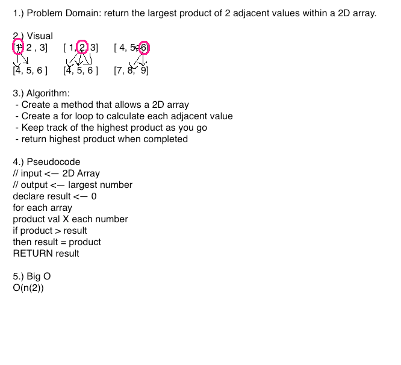

# Array Adjacent Product
Write a function called LargestProduct which takes in a 2D array, of arbitrary size. Return the largest product of 2 adjacent values within the 2D array.
Adjacent values might be horizontally, vertically, or diagonally connected.

## Challenge
Write at least three test assertions for each method that you define. Don't use any built in methods

## Solution

