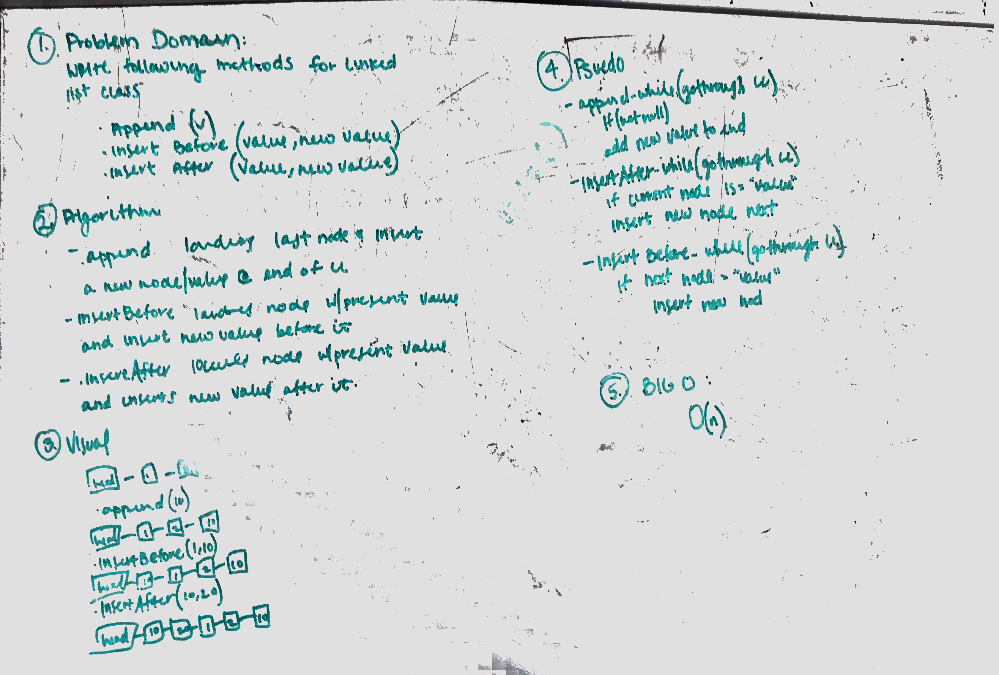

# Insert and shift middle index of array
Write a function called ll-insertions which takes in an array and the value to be added

## Challenge
Write a function called ll_insertions which takes in an array and the value to be added. Without utilizing any of the built-in methods available to your language, return an array with the new value added at the middle index.

## Solution
