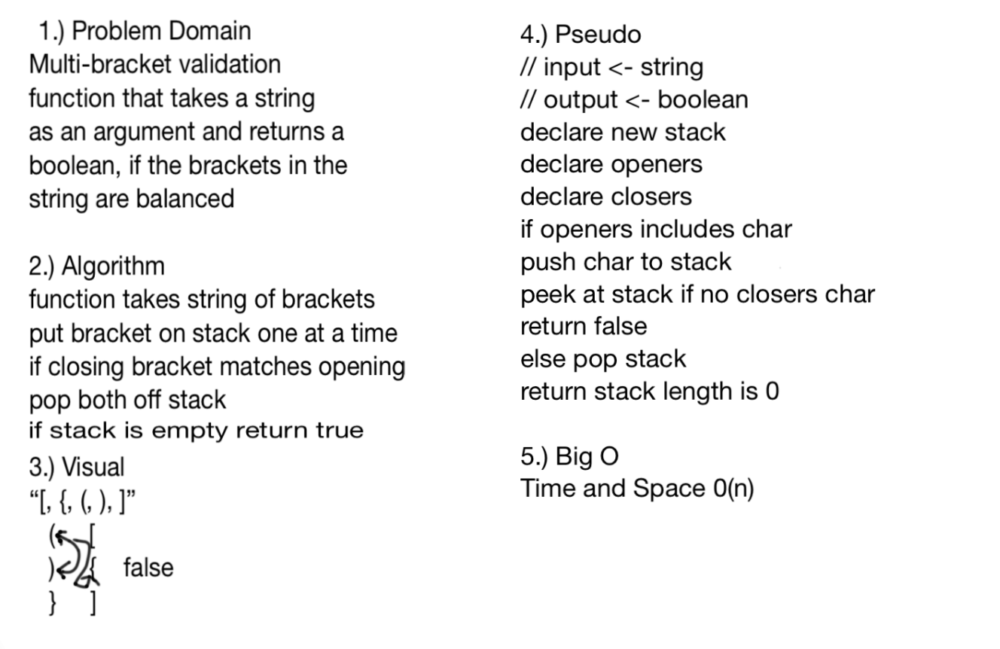

# Feature Tasks
On your main file, create…
C#: a function called bool MultiBracketValidation(string input)
JavaScript: a function called multiBracketValidation(input)
Python: a function called multi_bracket_validation(input)
Your function should take a string as its only argument, and should return a boolean representing whether or not the brackets in the string are balanced. There are 3 types of brackets:

Round Brackets : ()
Square Brackets : []
Curly Brackets : {}

## Challenge
Utilize the Single-responsibility principle: any methods you write should be clean, reusable, abstract component parts to the whole challenge. 

## Solution
